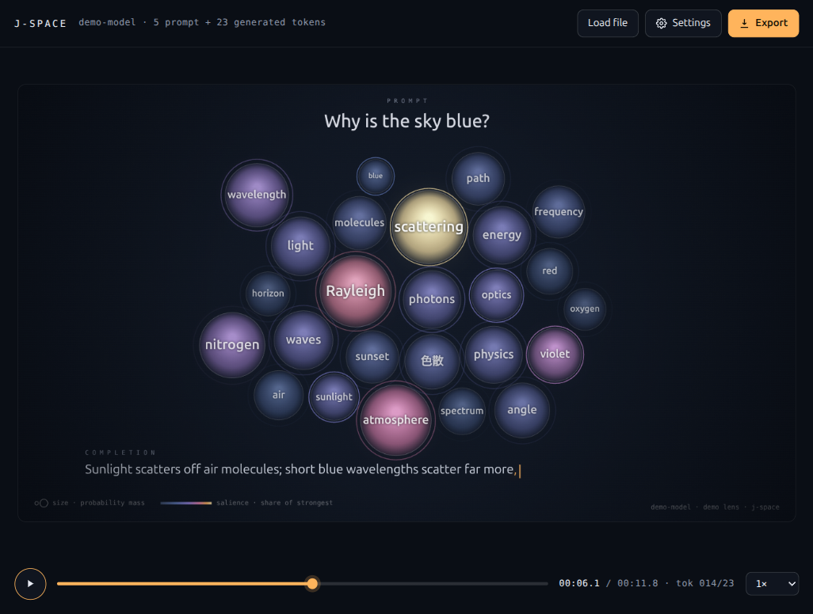
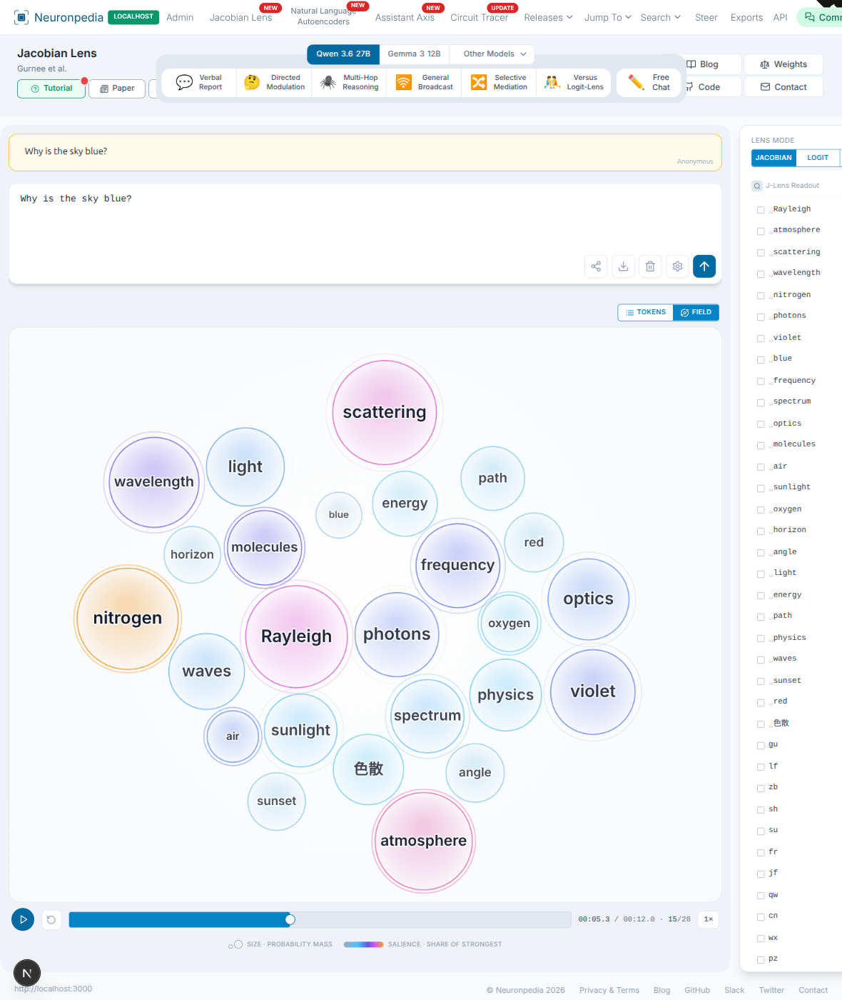

# almost-said

A single-file browser visualizer that turns a Jacobian-lens chat export into an animation of the concepts a model is holding across its layers, a beat before each word is written.

It reads a JSON export from [Neuronpedia's Jacobian-lens explorer](https://www.neuronpedia.org/jlens) and plays it back like a video: each bubble is a concept the lens surfaced, its size tracks how much decode probability the concept has accumulated, and its colour tracks salience relative to the strongest concept at that moment. The name is a nod to what the lens shows, the words a model was about to say but has not written yet.

**Live demo:** https://shyamvalsan.github.io/almost-said/



## Background

This is built on Anthropic's Jacobian-lens work, [*Verbalizable Representations Form a Global Workspace in Language Models*](https://www.anthropic.com/research/global-workspace) (July 2026). The Jacobian lens reads out, for a residual-stream activation at a given layer and token position, which vocabulary tokens that activation is disposed to make the model say. Applied across layers and positions, it surfaces a small set of verbalizable concepts the researchers call the J-space.

Neuronpedia hosts an [interactive explorer](https://www.neuronpedia.org/jlens) for open-weight models. This tool takes what the explorer computes for a single chat and animates it over time, so you can watch concepts flare and fade as the model reads the prompt and writes its answer.

- Anthropic write-up: https://www.anthropic.com/research/global-workspace
- Companion code (Apache-2.0, reference implementation): https://github.com/anthropics/jacobian-lens
- Neuronpedia explorer: https://www.neuronpedia.org/jlens

## Upstreaming to Neuronpedia

This started as a standalone tool, but the visualization belongs next to the data it reads. It is being contributed to Neuronpedia itself as a native "Field" view of the Jacobian Lens explorer, a Tokens/Field toggle that plays a run back over time using the explorer's own data and styling.

- Proposal: https://github.com/hijohnnylin/neuronpedia/issues/206
- Pull request: https://github.com/hijohnnylin/neuronpedia/pull/207



## Run it

It is one self-contained HTML file with no build step.

- **Open the file directly.** Download `index.html` and open it in any modern browser. The built-in demo works offline.
- **Serve it locally** if you prefer a real origin:
  ```
  python3 -m http.server 8000
  # then open http://localhost:8000/
  ```
- **Live demo.** The same file is served from GitHub Pages at https://shyamvalsan.github.io/almost-said/.

## Use it

1. Open the page.
2. Click **watch the demo** to see it run on the bundled synthetic export, or drop your own export onto the page (`examples/sky-demo.json` is a loadable sample).
3. Use the transport bar to play, pause, scrub, and change speed. Space toggles play/pause; the arrow keys step two seconds.
4. Open **Settings** to change how the field is built.
5. Click **Export** to save a WebM video (recorded locally) or an animated GIF (encoded frame by frame).

### Getting an export from Neuronpedia

Point the [Neuronpedia Jacobian-lens explorer](https://www.neuronpedia.org/jlens) at an open-weight model, run a chat, and export the result as JSON. Drop that file onto this page. The parser is tolerant about extra fields, so exports across models and lens types load without conversion.

## Export format

The tool expects a JSON object shaped like the explorer's chat export:

```jsonc
{
  "modelId": "some-model",
  "messages": [
    { "role": "user", "content": "Why is the sky blue?" },
    { "role": "assistant", "content": "Sunlight scatters off air molecules ..." }
  ],
  "tokens": [
    {
      "token": " molecules",     // the token text
      "is_generated": true,       // false for prompt tokens, true for generated ones
      "position": 12,
      "results": [
        {
          "type": "JACOBIAN_LENS",  // lens / probe type; shows up in the Lens picker
          "top_tokens": [            // one row per layer, top-k tokens the lens predicts
            [" blue", " light", " ..."],
            [" scatter", " ..."]
          ],
          "top_probs": [             // matching decode probabilities per layer
            [0.31, 0.08],
            [0.22]
          ]
        }
      ]
    }
  ]
}
```

Notes:

- `top_tokens[layer][k]` and `top_probs[layer][k]` line up. Layers run bottom to top.
- A token can carry more than one `results` entry, one per lens type. Each distinct `type` becomes an option in the Lens picker, plus a blended option when there is more than one.
- `messages` is optional. Without it, the prompt text is reconstructed from the prompt tokens.
- Junk tokens (whitespace, punctuation, special markers, replacement characters) are filtered out.

## Settings

- **Lens** picks which probe type feeds the field, or blends them.
- **Layer window** ignores layers below a chosen depth. Early layers are mostly token noise; the J-space sits in the middle-to-late layers.
- **Mass decay** sets how long a concept stays warm without being reinforced.
- **Pace** sets seconds per generated token.
- **Max bubbles** caps how many concepts are shown at once; the weakest are evicted first.
- **Hide the emitted token** drops the concept that matches the token actually written, so the field shows context rather than the obvious next word.
- **Reading phase** plays a sweep over the prompt before generation starts.
- **Caption & legend** toggles the model label and the size/colour key.

## What the encoding means

- **Bubble size** is accumulated decode probability mass: how strongly, and how repeatedly, the lens surfaced that concept across the layers in the window.
- **Bubble colour** is salience, the concept's share relative to the strongest concept on screen at that moment, ramped from cold slate through violet and rose to incandescent amber.
- **Reinforcement rings** flare when a concept is freshly boosted by the current token.

Hover any bubble for its salience, mass, the layer where it decodes strongest, and where it first surfaced.

## Privacy

Everything runs in your browser. No export data is uploaded anywhere. WebM export uses the browser's own recorder and needs no network. GIF export downloads a small encoder ([gif.js](https://github.com/jnordberg/gif.js)) from a CDN the first time you use it; the frames themselves are never sent anywhere.

## License

MIT. See [LICENSE](LICENSE).

The bundled `examples/sky-demo.json` is synthetic data generated by the page's demo, not a capture of any real model.
